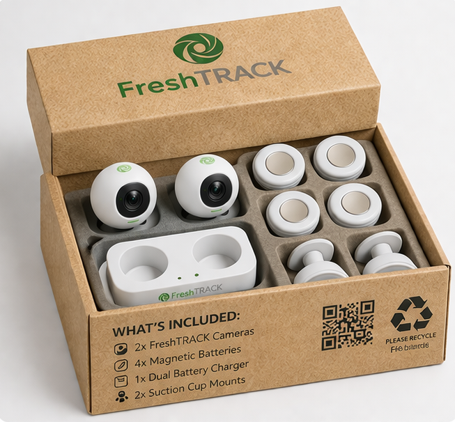

## Overview

FreshTRACK is an **AI-powered fridge-management system** that turns any conventional
fridge into a smart fridge using in-fridge cameras and a mobile app. The system
tracks fridge contents in real time, reduces household food waste, supports meal
planning, and saves households time and money.

The venture was developed as part of the **New Enterprise Development module** at
Dublin City University, where our team progressed from initial ideation through to
a full investor-ready business plan and a live Dragon's Den-style pitch before a
panel of six investors.

::: {.callout-note}
## The Problem
**67%** of people forget what is in their fridge (FreshTRACK Survey, 2025).
Irish households waste an average of **€700 per year** on food.^[EPA. (2023). *Food Waste Statistics*. Available at: [epa.ie](https://www.epa.ie/our-services/monitoring--assessment/waste/national-waste-statistics/food/)]

FreshTRACK solves this with a one-time hardware purchase and a companion app.
No subscription. No complexity.
:::

---

## The Product



{fig-alt="FreshTRACK prototype image" fig-align="center"}

---

## Key Numbers

:::: {.grid}

::: {.g-col-12 .g-col-md-4 .card .text-center .p-4}
### 💰 Investment Ask
**€100,000** for **9.5% equity**

€60k product development
€40k marketing
:::

::: {.g-col-12 .g-col-md-4 .card .text-center .p-4}
### 📈 Market Opportunity
**TAM** $2.83bn
**SAM** $1.61bn
**SOM** $4.8M (Europe)
:::

::: {.g-col-12 .g-col-md-4 .card .text-center .p-4}
### 📊 Financial Projections
**30,000 units** by FY30
**58.5% CAGR** over 4 years
Profitable by **2028**
:::

::::

---

## Venture Development Journey

This project was built across six assignments, each representing a distinct stage
of the startup development process:

::: {.callout-note icon=false}
### 📋 Concept Paper
Introduced FreshTRACK as a solution to household food waste. Defined the core
problem, proposed the product concept, mapped the customer journey, analysed
competitors, and outlined the initial technical architecture and early financial
logic.

[Download Concept Paper](../../freshtrack/freshtrack-concept-paper.pdf){target="_blank"}
:::

::: {.callout-note icon=false}
### 🔬 Feasibility Report
Evaluated FreshTRACK across product, market, organisational, legal, and financial
feasibility. Included primary customer research via survey and focus groups across
Ireland, Germany, Canada, and the USA. Used the Van Westendorp Pricing Model to
validate the unit price of **€121.57** excl. VAT.

[Download Feasibility Report](../../freshtrack/freshtrack-feasibility-report.pdf){target="_blank"}
:::

::: {.callout-note icon=false}
### 📣 Marketing Strategy Report
Defined the FreshTRACK brand and proposed a two-year marketing plan across five
coordinated initiatives: organic social media, trade shows, influencer
collaborations, corporate partnerships, and a poster campaign. Set campaign
objectives, budgets, timelines, and success metrics.

[Download Marketing Report](../../freshtrack/freshtrack-marketing-report.pdf){target="_blank"}
:::

::: {.callout-note icon=false}
### 🎤 Dragon's Den Pitch
Translated the full business case into a 7-minute investor pitch before a panel
of six investors, followed by a 13-minute Q&A. The pitch covered the problem,
solution, customer journey, competitive landscape, business model, financials,
and investment ask.

[Download Pitch Deck](../../freshtrack/freshtrack-pitch-deck.pdf){target="_blank"}
:::

::: {.callout-note icon=false}
### 📄 Business Plan
The most comprehensive deliverable: a full 45-page startup plan covering
executive summary, market analysis, marketing and sales strategy, R&D, staffing,
operations, financial projections, and funding requirements. The clearest evidence
of taking a venture from concept to execution-ready plan.

[Download Business Plan](../../freshtrack/freshtrack-business-plan.pdf){target="_blank"}
:::

---

## Financial Snapshot

| Metric | Value |
|--------|-------|
| Unit Price | €121.57 (excl. VAT) |
| Unit Cost | €85.09 |
| Gross Margin at Launch | 30% |
| Gross Margin by FY30 | 42.3% |
| EBITDA Margin by FY30 | 29.6% |
| Break-even | 2028 |
| Units by FY30 | 30,000 |
| Revenue CAGR | 58.5% over 4 years |

::: {.callout-tip}
## Primary Research
FreshTRACK's pricing and market validation was based on **64 survey respondents**
and **two focus groups** across Ireland, Germany, Canada, and the USA. The
Van Westendorp Pricing Model was applied, filtered to respondents aged 24+
spending €300+ per month on groceries.
:::

---

## Reflections

This was the most applied and team-oriented project of my degree. Taking an idea
from a blank page to a live investor pitch taught me things no classroom session
could – how to pressure-test assumptions, how to tell a story with numbers, and
how to disagree productively with teammates under deadline pressure.

The Dragon's Den format was particularly valuable. Knowing that six real investors
would challenge every number forced a level of rigour that I carried into every
other project afterwards.

---

::: {.small-text}
*Cover image: FreshTRACK brand assets, Team 22, DCU New Enterprise Development 2026*
:::